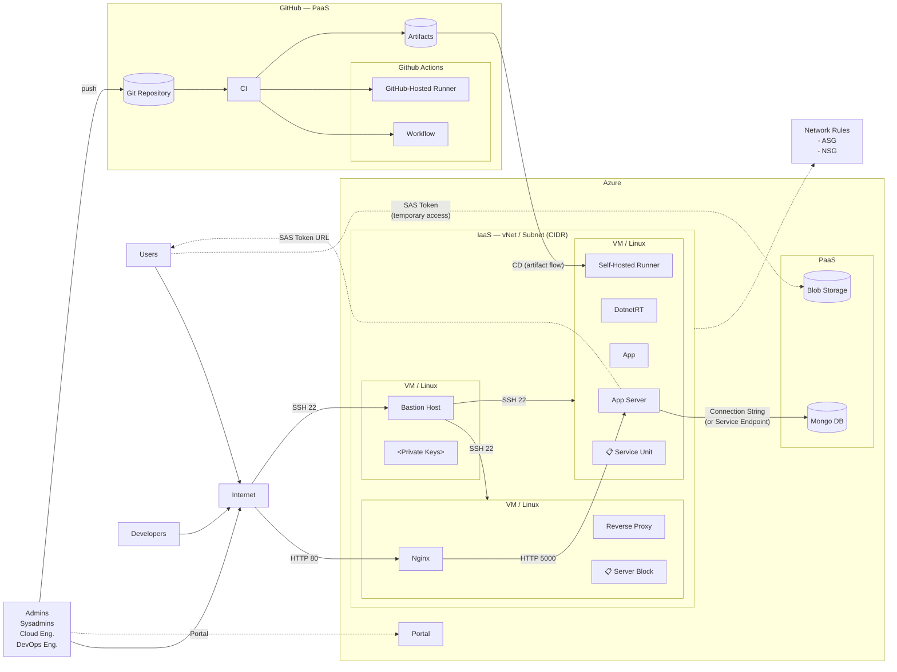

# Architecture Diagram

This diagram shows the complete architecture of the cloud application, mapping out the infrastructure, network topology, CI/CD pipeline, and the different actors who interact with the system.

## System Architecture

## Actors and Access Patterns

The architecture defines three distinct actor groups, each with their own access path into the system:

- **Users** — End users who access the application via the internet over HTTP (port 80). Their traffic hits the Reverse Proxy (Nginx), which forwards it to the App Server on port 5000. Users also fetch images directly from Blob Storage using temporary SAS token URLs (see PaaS section below).
- **Developers** — Access the VMs via SSH (port 22) through the Bastion Host. The Bastion Host acts as a secure jump server — developers never SSH directly into the application or proxy VMs. Private keys are required for authentication. Developers push code to the Git Repository but do not necessarily need access to the Azure Portal.
- **Admins / Sysadmins / Cloud Eng. / DevOps Eng.** — Manage infrastructure through the Azure Portal and push code to GitHub. They are responsible for provisioning, configuring, and managing the CI/CD pipeline.

## Infrastructure Layers

### IaaS — Azure Virtual Network

The core infrastructure runs on three Linux VMs inside a Virtual Network (vNet) with a Subnet defined by CIDR, protected by ASG (Application Security Groups) and NSG (Network Security Groups):

1. **Bastion Host** — Jump server for SSH access. Holds private keys. The only VM exposed to SSH from the internet.
2. **Reverse Proxy** — Runs Nginx with a **Server Block** configuration (the Nginx config file that defines how traffic is routed). Receives HTTP traffic on port 80 and forwards to the App Server on port 5000.
3. **App Server** — Runs the .NET application (DotnetRT runtime, App). Managed by a SystemD **Service Unit** (the systemd config file that keeps the app running as a service). Also runs a **self-hosted GitHub Actions runner** that pulls deployment artifacts from GitHub.

> **Callout tags in the diagram:** "Server Block" and "Service Unit" are configuration file reminders — they indicate the Nginx server block config and the SystemD unit file that students need to write on these VMs.

### PaaS — Managed Services

Both PaaS services sit outside the Virtual Network:

- **Blob Storage** — Serves images and static assets directly to the user's browser. The App Server generates **SAS tokens** (Shared Access Signatures) that give the browser temporary, time-limited access to fetch files directly from Blob Storage. This means image traffic flows Browser → Blob Storage, not through the App Server.
- **MongoDB (CosmosDB)** — The application database, accessed by the App Server via a connection string. The connection can go either over the public internet or privately via **Azure Service Endpoints**, which route traffic over the Azure backbone without exposing it to the public internet (while the database still sits outside the vNet).

## CI/CD Pipeline (GitHub Actions)

The deployment pipeline uses two types of runners:

1. Admins push code to the **Git Repository**.
2. **CI** (Continuous Integration) triggers a **Workflow** on a **GitHub-hosted runner**, which builds the application.
3. Build output is stored as **Artifacts** in GitHub.
4. **CD** (Continuous Deployment): The **self-hosted runner** on the App Server VM pulls the artifacts from GitHub and deploys them locally. The arrow direction in the diagram represents artifact flow (GitHub → App Server), not the request direction (the self-hosted runner initiates the pull).

## Technology Stack

| Category       | Technologies                         |
| -------------- | ------------------------------------ |
| **IaC**        | AZ CLI, ARM, Cloud Init             |
| **Automation** | Bash, GitHub Actions                 |
| **Languages**  | C# / .NET Core, JSON / YAML, Bash   |
