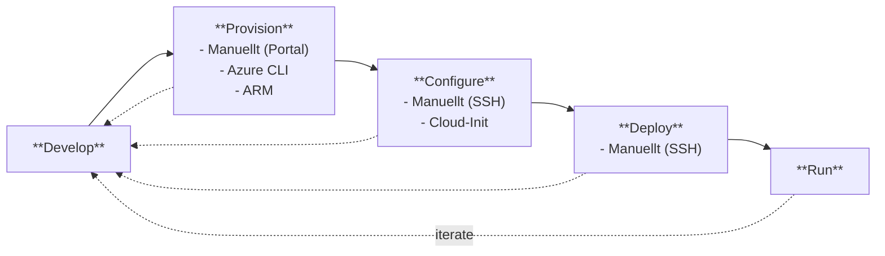
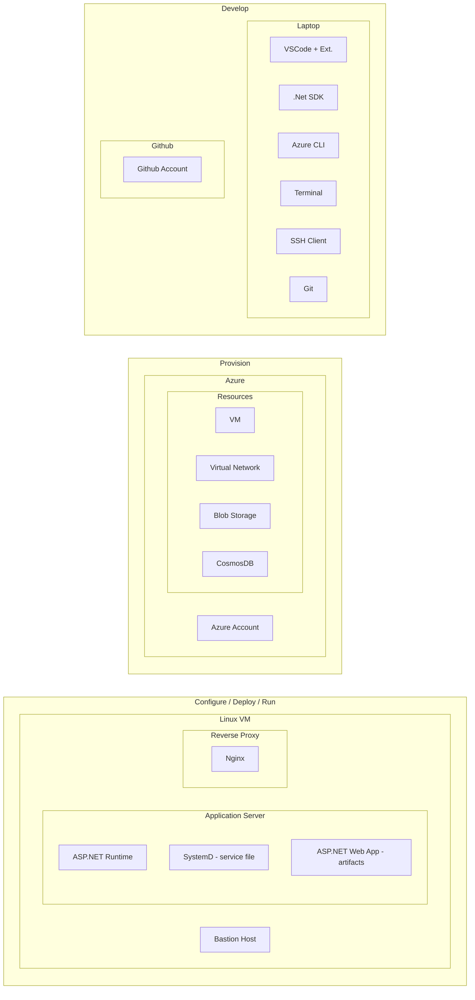

# Livscykel (Lifecycle Diagram)

This diagram maps the full lifecycle of deploying a cloud application, showing both the phases (what you do) and the environments (where you do it).

## Phases

The lifecycle consists of five phases, executed iteratively:

1. **Develop** — Write code locally on your laptop.
2. **Provision** — Create the Azure infrastructure (VM, Virtual Network, Blob Storage, CosmosDB).
3. **Configure** — Set up the Linux VM to run your application (runtime, Nginx, SystemD).
4. **Deploy** — Push the application artifacts onto the VM.
5. **Run** — The application is live and serving traffic.

The feedback arrows back to Develop show that this is an iterative process — you cycle through these phases repeatedly as you develop, reconfigure, redeploy, and observe.

### Manual first, automate later

The "Manuellt" labels are intentional. At this stage in the course, students perform everything manually: provisioning through the Azure Portal, configuring and deploying via SSH. The alternatives listed (Azure CLI, ARM, Cloud-Init) are the automation tools introduced later. The pedagogical approach is: understand the process manually first, then automate it.

## Environments per Phase

Each phase maps to a specific environment where the work takes place:

- **Develop** → Your **laptop** (VSCode, .NET SDK, Azure CLI, Terminal, SSH Client, Git) and **GitHub** for source control.
- **Provision** → **Azure** (the cloud resources you create: VM, Virtual Network, Blob Storage, CosmosDB).
- **Configure / Deploy / Run** → All happen on the **Linux VM**, which hosts the Application Server (ASP.NET Runtime, SystemD service, deployed artifacts), the Reverse Proxy (Nginx), and the Bastion Host.
