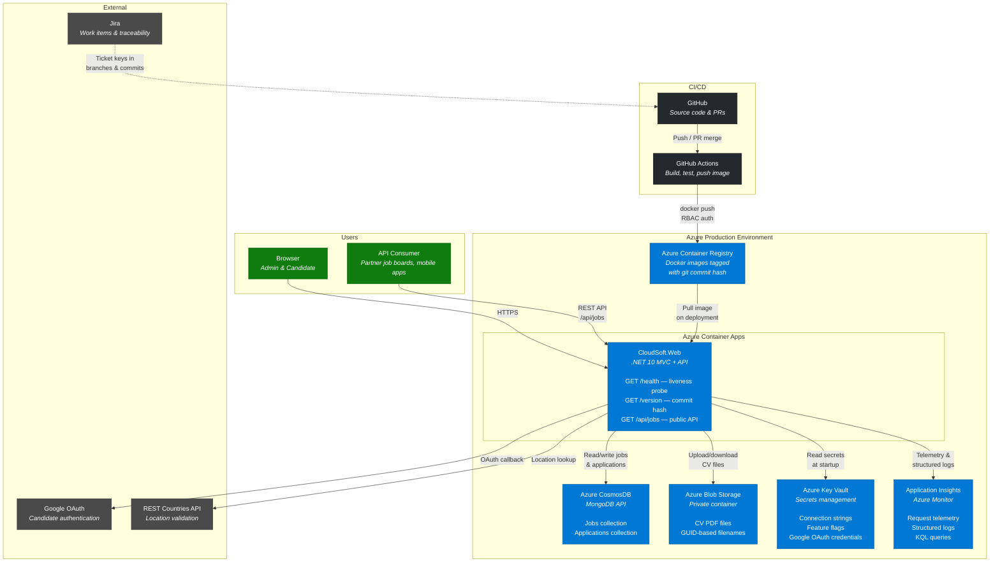
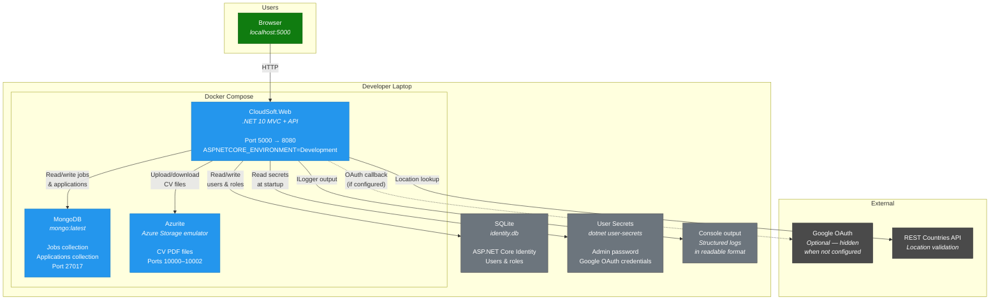

# CloudSoft Recruitment Portal — Architecture Overview

## Production Architecture (Azure)



## Runtime Data Flow

| Flow | From | To | What |
|------|------|----|------|
| Browse/apply | Browser | Container App | HTTPS, cookie auth |
| API access | API consumer | Container App | REST, JSON responses |
| Identity / auth | Container App | SQLite (ephemeral) | Local filesystem, recreated on startup |
| Job/application data | Container App | CosmosDB | MongoDB wire protocol |
| CV storage | Container App | Blob Storage | PDF upload/download |
| Secrets | Key Vault | Container App | Connection strings, credentials |
| Auth | Container App | Google | OAuth 2.0 redirect flow |
| Location lookup | Container App | REST Countries | HTTP GET, JSON response |
| Telemetry | Container App | Application Insights | Structured logs, request traces |
| Health probes | Container Apps platform | Container App | GET /health, liveness/readiness |
| Image pull | Container Registry | Container App | Docker image tagged with commit hash |

## Local Development Architecture



### Local vs Production Service Mapping

| Local (Docker Compose) | Production (Azure) | Purpose |
|---|---|---|
| MongoDB container | Azure CosmosDB (MongoDB API) | Job & application data |
| Azurite container | Azure Blob Storage | CV file storage |
| SQLite file | SQLite file (ephemeral, recreated on startup) | Identity / auth |
| User Secrets | Azure Key Vault | Secrets management |
| Console output | Application Insights | Logging & telemetry |
| Docker Compose | Azure Container Apps | Container orchestration |
| Local Docker build | Azure Container Registry | Image storage |

## Runtime Scenarios

The same Docker image supports four runtime scenarios via configuration and graceful degradation:

| Scenario | Data | Blobs | Identity | Secrets | Telemetry |
|---|---|---|---|---|---|
| **1. In-Memory Local** | In-memory repos | Local disk | SQLite | User Secrets | Console |
| **2. Docker Compose** | MongoDB container | Azurite container | SQLite (Docker volume) | Environment vars | Console |
| **3. Azure In-Memory** | In-memory repos | Local disk | SQLite (ephemeral) | Key Vault | Application Insights |
| **4. Full Production** | CosmosDB | Azure Blob Storage | SQLite (ephemeral) | Key Vault | Application Insights |

Scenario 3 is an intermediate step for verifying the deployment pipeline works (container image, ACA, health probes, Key Vault) without needing CosmosDB or Blob Storage provisioned.

## Traceability Chain

```
Jira ticket (CLO-42)
  → Git branch (feature/CLO-42-structured-logging)
    → Commits (CLO-42: add structured logging)
      → Pull request (GitHub)
        → GitHub Actions build
          → Docker image (cloudsoft-web:a1b2c3d)
            → Azure Container Registry
              → Container App running image
                → GET /version → "1.0.0+a1b2c3d"
```
