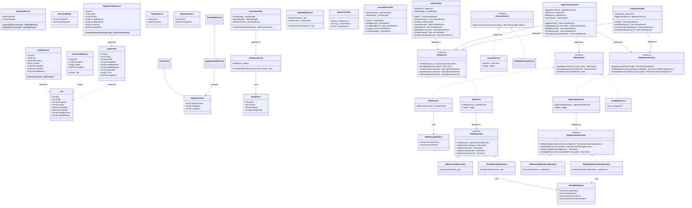

# Class Diagram

```mermaid
classDiagram
    direction TB

    %% ── Domain Models ──────────────────────────────────────
    class Job {
        +string Id
        +string Title
        +string Description
        +string Location
        +DateTime Deadline
        +DateTime PostedAt
        +string PostedByUserId
        +string PostedByName
    }

    class Application {
        +string Id
        +string JobId
        +string JobTitle
        +string CandidateId
        +string CandidateEmail
        +string CandidateName
        +string CoverLetter
        +string? CvUrl
        +DateTime AppliedAt
    }

    class ApplicationUser {
        +string? DisplayName
        +string? FirstName
        +string? LastName
    }

    class OperationResult {
        +bool IsSuccess
        +string Message
        +Success(string message)$ OperationResult
        +Failure(string message)$ OperationResult
    }

    class ErrorViewModel {
        +string? RequestId
        +bool ShowRequestId
    }

    IdentityUser <|-- ApplicationUser

    %% ── DTOs ───────────────────────────────────────────────
    class CreateJobRequest {
        +string Title
        +string Description
        +string Location
        +DateTime Deadline
        +ToJob() Job
    }

    class JobResponse {
        +string Id
        +string Title
        +string Description
        +string Location
        +DateTime Deadline
        +DateTime PostedAt
        +string PostedByName
        +FromJob(Job job)$ JobResponse
    }

    class ApplicationResponse {
        +string Id
        +string JobId
        +string JobTitle
        +string CandidateEmail
        +string CandidateName
        +string CoverLetter
        +DateTime AppliedAt
        +FromApplication(Application app)$ ApplicationResponse
    }

    class TokenRequest {
        +string Email
        +string Password
    }

    class TokenResponse {
        +string Token
        +DateTime Expiration
    }

    %% ── Options ────────────────────────────────────────────
    class MongoDbOptions {
        +string ConnectionString
        +string DatabaseName
        +string JobsCollectionName
        +string ApplicationsCollectionName
    }

    class BlobStorageOptions {
        +string ConnectionString
        +string ContainerName
    }

    class JwtOptions {
        +string Key
        +string Issuer
        +string Audience
        +int ExpirationMinutes
    }

    %% ── Repository Interfaces ──────────────────────────────
    class IJobRepository {
        <<interface>>
        +GetAllAsync() Task~IEnumerable~Job~~
        +GetByIdAsync(string id) Task~Job?~
        +AddAsync(Job job) Task~bool~
        +UpdateAsync(Job job) Task~bool~
        +DeleteAsync(string id) Task~bool~
    }

    class IApplicationRepository {
        <<interface>>
        +GetByCandidateIdAsync(string candidateId) Task~IEnumerable~Application~~
        +GetByJobIdAsync(string jobId) Task~IEnumerable~Application~~
        +AddAsync(Application application) Task~bool~
        +HasAppliedAsync(string candidateId, string jobId) Task~bool~
    }

    %% ── Repository Implementations ────────────────────────
    class InMemoryJobRepository {
        -ConcurrentDictionary _jobs
    }

    class MongoDbJobRepository {
        -IMongoCollection~Job~ _jobs
    }

    class InMemoryApplicationRepository {
        -ConcurrentDictionary _applications
    }

    class MongoDbApplicationRepository {
        -IMongoCollection~Application~ _applications
    }

    IJobRepository <|.. InMemoryJobRepository
    IJobRepository <|.. MongoDbJobRepository
    IApplicationRepository <|.. InMemoryApplicationRepository
    IApplicationRepository <|.. MongoDbApplicationRepository

    MongoDbJobRepository --> MongoDbOptions : uses
    MongoDbApplicationRepository --> MongoDbOptions : uses

    %% ── Service Interfaces ─────────────────────────────────
    class IJobService {
        <<interface>>
        +GetAllJobsAsync() Task~IEnumerable~Job~~
        +GetJobByIdAsync(string id) Task~Job?~
        +CreateJobAsync(Job job) Task~OperationResult~
        +UpdateJobAsync(Job job) Task~OperationResult~
        +DeleteJobAsync(string id) Task~OperationResult~
    }

    class IApplicationService {
        <<interface>>
        +ApplyAsync(Application app) Task~OperationResult~
        +GetMyApplicationsAsync(string candidateId) Task~IEnumerable~Application~~
        +GetApplicationsForJobAsync(string jobId) Task~IEnumerable~Application~~
    }

    class IBlobService {
        <<interface>>
        +UploadAsync(Stream, string, string) Task~string~
        +DownloadAsync(string fileName) Task~Stream?~
        +DeleteAsync(string fileName) Task
    }

    class ICountryService {
        <<interface>>
        +SearchCountriesAsync(string query) Task~IEnumerable~string~~
    }

    %% ── Service Implementations ────────────────────────────
    class JobService {
        -IJobRepository _jobRepository
        -ILogger _logger
    }

    class ApplicationService {
        -IApplicationRepository _applicationRepository
        -ILogger _logger
    }

    class BlobService {
        -BlobContainerClient _containerClient
    }

    class LocalBlobService {
        -string _storagePath
    }

    class CountryService {
        -HttpClient _httpClient
        -ILogger _logger
    }

    class DisabledCountryService
    class JwtTokenService {
        -JwtOptions _options
        +GenerateToken(string, string, string, string) string
    }

    IJobService <|.. JobService
    IApplicationService <|.. ApplicationService
    IBlobService <|.. BlobService
    IBlobService <|.. LocalBlobService
    ICountryService <|.. CountryService
    ICountryService <|.. DisabledCountryService

    JobService --> IJobRepository : depends on
    ApplicationService --> IApplicationRepository : depends on
    BlobService --> BlobStorageOptions : uses
    JwtTokenService --> JwtOptions : uses

    %% ── Data Context ───────────────────────────────────────
    class ApplicationDbContext
    IdentityDbContext <|-- ApplicationDbContext
    ApplicationDbContext --> ApplicationUser : manages

    %% ── Middleware ──────────────────────────────────────────
    class ApiKeyMiddleware {
        -RequestDelegate _next
        -IConfiguration _configuration
        +InvokeAsync(HttpContext) Task
    }

    %% ── MVC Controllers ────────────────────────────────────
    class HomeController {
        +Index() IActionResult
        +Privacy() IActionResult
        +Error() IActionResult
    }

    class AccountController {
        -SignInManager _signInManager
        -UserManager _userManager
        +Login() IActionResult
        +GoogleLogin() IActionResult
        +GoogleCallback() Task~IActionResult~
        +Logout() Task~IActionResult~
        +AccessDenied() IActionResult
    }

    class JobController {
        -IJobService _jobService
        -UserManager _userManager
        +Index() Task~IActionResult~
        +Details(string id) Task~IActionResult~
        +Create() IActionResult
        +Create(Job job) Task~IActionResult~
        +Edit(string id) Task~IActionResult~
        +Edit(string id, Job job) Task~IActionResult~
        +Delete(string id) Task~IActionResult~
        +DeleteConfirmed(string id) Task~IActionResult~
    }

    class ApplicationController {
        -IApplicationService _applicationService
        -IJobService _jobService
        -IBlobService _blobService
        -UserManager _userManager
        +Apply(string id) Task~IActionResult~
        +Apply(Application, IFormFile) Task~IActionResult~
        +MyApplications() Task~IActionResult~
        +ForJob(string id) Task~IActionResult~
        +DownloadCv(string fileName) Task~IActionResult~
    }

    %% ── API Controllers ────────────────────────────────────
    class JobApiController {
        -IJobService _jobService
        -IApplicationService _applicationService
        +GetAll() Task~ActionResult~
        +GetById(string id) Task~ActionResult~
        +Create(CreateJobRequest) Task~ActionResult~
        +GetApplications(string id) Task~ActionResult~
    }

    class TokenController {
        -UserManager _userManager
        -SignInManager _signInManager
        -JwtTokenService _jwtTokenService
        +CreateToken(TokenRequest) Task~ActionResult~
    }

    %% ── Controller Dependencies ────────────────────────────
    JobController --> IJobService : depends on
    ApplicationController --> IApplicationService : depends on
    ApplicationController --> IJobService : depends on
    ApplicationController --> IBlobService : depends on
    JobApiController --> IJobService : depends on
    JobApiController --> IApplicationService : depends on
    TokenController --> JwtTokenService : depends on

    %% ── DTO Relationships ──────────────────────────────────
    JobResponse ..> Job : maps from
    ApplicationResponse ..> Application : maps from
    CreateJobRequest ..> Job : creates
    Application ..> Job : references
```
